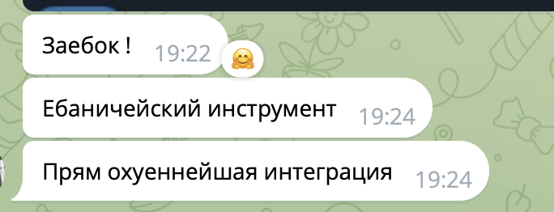
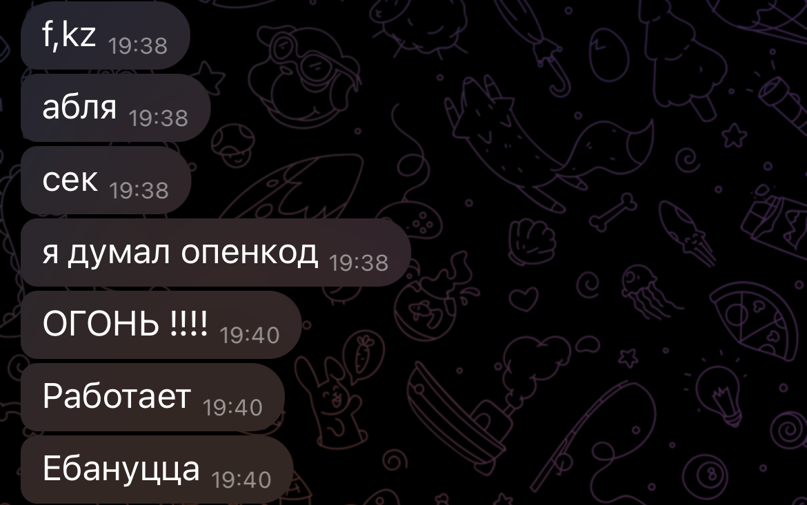

# ccremote

Control Claude Code from your phone via Telegram.

ccremote bridges Claude Code CLI to Telegram DMs. Send prompts from your phone, get streaming responses via live draft previews, send photos/documents/voice messages — all without sitting at your computer.

## How it works

```
Phone (Telegram)            Local Machine
──────────────────          ──────────────────
  DM with bot               ccremote
  "fix the bug"  ────►       ├─ Telegram bot (aiogram)
  ◄ streaming draft...       ├─ claude --print --resume <id>
  ◄ final response           └─ Whisper transcription
```

1. Run `uvx ccremote .` in any project directory
2. Chat with Claude in your bot's DM
3. Responses stream as live draft previews, then appear as final messages
4. Send photos, documents, or voice messages
5. Permission denials show inline buttons to approve and retry

## Quick start

1. **Create a Telegram bot** — open [@BotFather](https://t.me/BotFather), send `/newbot`, follow the prompts, copy the token
2. **Get your Telegram user ID** — open [@userinfobot](https://t.me/userinfobot), send `/start`, copy the number
3. **Create a `.ccremote` file** in your project directory:
   ```env
   CCREMOTE_BOT_TOKEN=123456:ABC-DEF1234ghIkl-zyx57W2v1u123ew11
   CCREMOTE_ALLOWED_USER=123456789
   ```
4. **Run:**
   ```bash
   uvx ccremote .
   ```
5. Open your bot's DM in Telegram and start chatting with Claude

> **Tip:** Add `.ccremote` to your global `.gitignore` — it contains secrets.

## Prerequisites

- [Claude Code CLI](https://docs.anthropic.com/en/docs/claude-code) installed and authenticated
- Python 3.11+ and [uv](https://docs.astral.sh/uv/) (recommended) or pip
- A Telegram bot token (see step 1 above)
- OpenAI API key (optional, only needed for voice message transcription)

### Install locally (for development)

```bash
git clone https://github.com/nurikk/ccremote.git
cd ccremote
uv venv .venv
source .venv/bin/activate
uv pip install -e .
```

## Configuration

### Environment variables vs `.ccremote` file

You can configure ccremote in two ways — they can be combined:

**Option A: Global environment variables** (apply to all projects)

```bash
# Add to ~/.zshrc or ~/.bashrc
export CCREMOTE_BOT_TOKEN=123456:ABC-DEF1234ghIkl-zyx57W2v1u123ew11
export CCREMOTE_ALLOWED_USER=123456789
export CCREMOTE_OPENAI_API_KEY=sk-...   # optional, for voice messages
```

**Option B: Per-project `.ccremote` file** (overrides env vars for that project)

```env
CCREMOTE_BOT_TOKEN=999888:XYZ-different-bot-token
CCREMOTE_ALLOWED_USER=123456789
CCREMOTE_OPENAI_API_KEY=sk-...
```

**Priority:** `.ccremote` file > environment variables > defaults.

### Configuration options

| Variable | Required | Default | Description |
|----------|----------|---------|-------------|
| `CCREMOTE_BOT_TOKEN` | yes | — | Telegram bot token from @BotFather |
| `CCREMOTE_ALLOWED_USER` | yes | — | Your Telegram user ID |
| `CCREMOTE_OPENAI_API_KEY` | no | `""` | OpenAI key for voice transcription |
| `CCREMOTE_LOG_LEVEL` | no | `info` | `debug`, `info`, `warning`, `error` |
| `CCREMOTE_INCLUDE_PARTIAL_MESSAGES` | no | `true` | Include partial messages in stream |
| `CCREMOTE_DRAFT_THROTTLE_MS` | no | `300` | Min ms between draft updates |
| `CCREMOTE_MAX_MESSAGE_LENGTH` | no | `4000` | Max chars per Telegram message |
| `CCREMOTE_CLAUDE_ALLOWED_TOOLS` | no | — | JSON array of allowed tools (all if unset) |

## Usage

```bash
# With uvx (no install needed)
uvx ccremote .

# Or if installed locally
ccremote .
ccremote ~/code/myproject
```

That's it. The bot connects to Telegram and you can start chatting.

### Message types

- **Text** — sent directly as prompts to Claude
- **Photos** — downloaded to `.ccremote-attachments/` in the project, path passed to Claude
- **Documents** — same as photos, keeps original filename
- **Voice messages** — transcribed via OpenAI Whisper, sent as text (requires `CCREMOTE_OPENAI_API_KEY`)

### Permission handling

When Claude tries to use a tool that's blocked by permissions, you'll see an inline keyboard:

```
⚠️ Permission denied:
  • Bash: ls ~/Downloads

[✅ Allow]  [❌ Skip]
```

Tapping **Allow** re-runs the prompt with the denied tools added to `--allowedTools`.

### Session continuity

ccremote uses `claude --print --resume <session_id>` to maintain conversation context. Each message continues the same Claude session, so context builds up naturally across your conversation.

## Architecture

```
src/ccremote/
├── cli.py          Entry point — starts bot, creates session
├── bot.py          aiogram dispatcher, message sending helpers
├── relay.py        Claude ↔ Telegram relay, streaming, permissions
├── markdown.py     Markdown → Telegram HTML converter
├── config.py       pydantic-settings configuration
└── models.py       Pydantic data models (Session)
```

**Key design decisions:**
- Single session mode — one `ccremote` process per project, DM-only. This is intentional: `sendMessageDraft` only works in private chats, supergroup forums don't allow bots to create new threads via the Bot API, making group-based workflows impractical
- Each prompt spawns `claude --print --resume <id>` (stateless process, persistent session)
- `sendMessageDraft` (Bot API 9.3+) for flicker-free live streaming
- Markdown converted to Telegram HTML for formatted output
- Per-project `.ccremote` overrides global env vars

## Development

```bash
# Install dev dependencies
uv pip install -e ".[dev]"

# Run tests
python -m pytest tests/ -v

# Lint
ruff check src/ tests/

# Format
ruff format src/ tests/

# Type check
ty check src/
```

## User Feedback

<p>
  
  
</p>

## License

MIT
